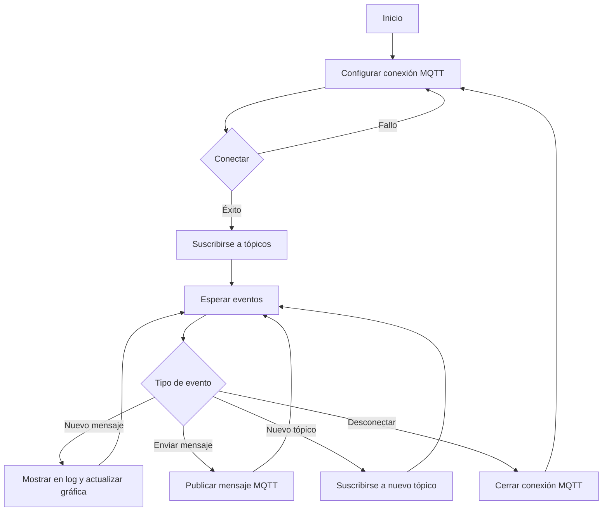

# MQTT Manager

## Descripción
MQTT Manager es una aplicación web interactiva construida con React que permite a los usuarios conectarse a un broker MQTT, suscribirse a tópicos, enviar y recibir mensajes, y visualizar datos en tiempo real. La aplicación presenta una interfaz de usuario intuitiva con un diseño inspirado en terminales, ofreciendo una experiencia familiar para los usuarios técnicos.

## Características principales
- Conexión configurable a brokers MQTT
- Suscripción y gestión de múltiples tópicos
- Envío y recepción de mensajes MQTT en tiempo real
- Visualización gráfica de datos numéricos recibidos
- Interfaz responsiva y adaptable a diferentes tamaños de pantalla

## Requisitos previos
- Node.js (versión 12.0 o superior)
- npm (normalmente viene con Node.js)

## Instalación

1. Clona el repositorio:
   ```
   git clone https://github.com/tu-usuario/mqtt-manager.git
   cd mqtt-manager
   ```

2. Instala las dependencias:
   ```
   npm install
   ```

3. Inicia la aplicación en modo desarrollo:
   ```
   npm start
   ```

4. Abre tu navegador y visita `http://localhost:3000`

## Uso

1. **Configuración de la conexión MQTT:**
   - Ingresa los detalles del broker MQTT en los campos correspondientes.
   - Haz clic en "Connect" para establecer la conexión.

2. **Gestión de tópicos:**
   - Usa el panel lateral para ver los tópicos suscritos.
   - Ingresa un nuevo tópico en el campo de texto y haz clic en "Subscribe" para añadirlo.

3. **Envío de mensajes:**
   - Selecciona un tópico de la lista.
   - Usa la barra de entrada en la parte inferior para escribir y enviar mensajes.

4. **Visualización de mensajes:**
   - Los mensajes recibidos y enviados se muestran en el área central.
   - El log de mensajes se desplaza automáticamente para mostrar los mensajes más recientes.

5. **Gráfica de datos:**
   - La gráfica muestra los últimos 20 valores numéricos recibidos para el tópico seleccionado.

6. **Desconexión:**
   - Haz clic en "Disconnect" para cerrar la conexión con el broker MQTT.

## Estructura del proyecto

```
mqtt-manager/
│
├── src/
│   ├── components/
│   │   ├── StatusBar.js
│   │   ├── Sidebar.js
│   │   ├── MessageLog.js
│   │   ├── InputBar.js
│   │   ├── MQTTConfig.js
│   │   └── MessageGraph.js
│   │
│   ├── MQTTManager.js
│   ├── App.js
│   └── index.js
│
├── public/
│   └── index.html
│
├── package.json
└── README.md
```

## Diagrama de flujo

El siguiente diagrama muestra el flujo básico de la aplicación MQTT Manager:



## Contribuciones
Las contribuciones son bienvenidas. Por favor, abre un issue para discutir cambios mayores antes de crear un pull request.

## Licencia
Este proyecto está licenciado bajo la Licencia MIT. Ver el archivo `LICENSE` para más detalles.